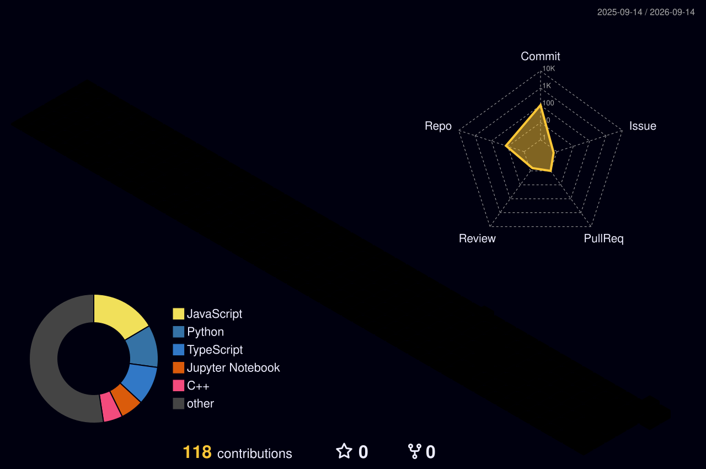

  

 

- 👋 **Hi, I''m Niraj Borole!**
- 🎓 I am currently a **Pre-final year Undergraduate Student** at **IIT Kharagpur**.
- 🚀 Aspiring **Software Engineer &amp; Systems Developer**.
- 🔭 I’m currently working on building scalable applications, low-latency architectures, and optimized algorithms.
- 🌱 I’m currently learning advanced **Backend Systems**, **Distributed Architectures**, and **AI Pipelines**.
- ⚡ Competitive programming enthusiast &amp; active problem solver.
- 💬 Ask me about **C++**, **System Design**, **Full-Stack Development**, and **Algorithms**.
- 📫 Reach out to me: **[nirajborole0@gmail.com](mailto:nirajborole0@gmail.com)**

---

### 🌐 Connect with me:

  
  &nbsp;
  
  &nbsp;
  
  &nbsp;
  

---

<!-- ═══════════════════════════════════════════════════════════════════════ -->
<!-- SYSTEM ARCHITECTURE (TECH STACK)                                        -->
<!-- ═══════════════════════════════════════════════════════════════════════ -->
<h3 align="left" style="border-bottom: none; margin-top: 24px; margin-bottom: 18px;">
  S Y S T E M &nbsp; A R C H I T E C T U R E
</h3>

<table width="100%" border="0" cellpadding="0" cellspacing="0" style="border: none; border-collapse: collapse;">
  <tr style="border: none;">
    <td width="180" align="left" valign="top" style="border: none; padding: 10px 0;">
      <samp style="color: #00BFFF; font-family: 'SF Mono', Monaco, 'Fira Code', monospace; font-size: 13px; font-weight: 800; letter-spacing: 1.5px;">LANGUAGES</samp>
    </td>
    <td align="left" valign="top" style="border: none; padding: 10px 0;">
      <samp style="color: #E6EDF3; font-family: 'SF Mono', Monaco, 'Fira Code', monospace; font-size: 13.5px; font-weight: 500;">C++, C, Python, JavaScript, TypeScript, SQL, Java, Bash</samp>
    </td>
  </tr>
  <tr style="border: none;">
    <td width="180" align="left" valign="top" style="border: none; padding: 10px 0;">
      <samp style="color: #00BFFF; font-family: 'SF Mono', Monaco, 'Fira Code', monospace; font-size: 13px; font-weight: 800; letter-spacing: 1.5px;">FRAMEWORKS</samp>
    </td>
    <td align="left" valign="top" style="border: none; padding: 10px 0;">
      <samp style="color: #E6EDF3; font-family: 'SF Mono', Monaco, 'Fira Code', monospace; font-size: 13.5px; font-weight: 500;">React, Next.js, Node.js, Express.js, FastAPI, Spring Boot, Tailwind CSS</samp>
    </td>
  </tr>
  <tr style="border: none;">
    <td width="180" align="left" valign="top" style="border: none; padding: 10px 0;">
      <samp style="color: #00BFFF; font-family: 'SF Mono', Monaco, 'Fira Code', monospace; font-size: 13px; font-weight: 800; letter-spacing: 1.5px;">DATA &amp; AI</samp>
    </td>
    <td align="left" valign="top" style="border: none; padding: 10px 0;">
      <samp style="color: #E6EDF3; font-family: 'SF Mono', Monaco, 'Fira Code', monospace; font-size: 13.5px; font-weight: 500;">TensorFlow, Keras, OpenCV, PyTorch, ChromaDB, RAG, MongoDB, PostgreSQL</samp>
    </td>
  </tr>
  <tr style="border: none;">
    <td width="180" align="left" valign="top" style="border: none; padding: 10px 0;">
      <samp style="color: #00BFFF; font-family: 'SF Mono', Monaco, 'Fira Code', monospace; font-size: 13px; font-weight: 800; letter-spacing: 1.5px;">TOOLCHAIN</samp>
    </td>
    <td align="left" valign="top" style="border: none; padding: 10px 0;">
      <samp style="color: #E6EDF3; font-family: 'SF Mono', Monaco, 'Fira Code', monospace; font-size: 13.5px; font-weight: 500;">Docker, Git, GitHub, Linux, Postman, VS Code, Google Colab, Cursor</samp>
    </td>
  </tr>
</table>

 

<!-- ═══════════════════════════════════════════════════════════════════════ -->
<!-- SECTION: GITHUB STATS & STREAKS (ENLARGED & BORDERLESS)                 -->
<!-- ═══════════════════════════════════════════════════════════════════════ -->

  

 

<!-- ═══════════════════════════════════════════════════════════════════════ -->
<!-- SECTION: 3D ISOMETRIC CONTRIBUTION GRAPH                                -->
<!-- ═══════════════════════════════════════════════════════════════════════ -->
<h3 align="left" style="border-bottom: none; margin-top: 24px; margin-bottom: 14px;">
  C O N T R I B U T I O N &nbsp; G R A P H
</h3>

  

